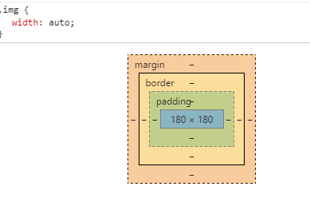
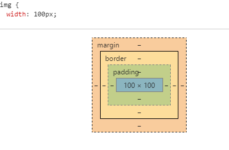

### 10 Visual formatting model details

#### 10.1 containing block 的定义

在一些场景下，一个元素的盒子的尺寸和位置是基于该元素的 `containing block`(包含块, 后文中简称 `CB`) 来计算的，元素的 `containing block` 是一个矩形区域，定义如下：

1. 根元素的 `containing block` 叫做 `initial containing block` (初始化包含块, 后文中简称 `ICB`) 。对于 `continuous media` (连续媒体，我们最常见的电脑中的浏览器就是其中的一种)，`IBC` 的尺寸和 `viewport` 一致，而且被固定在画布的起点位置；对于 `paged media` IBC 就是页面区域。 IBC 的 `direction` 的属性值与根元素一致。

2. 除根元素外的其他元素，如果元素的 `position` 是 `relative`, `static`, 那么，元素的 CB 是由该元素的最近 `block container` 类型的或者是新建了 `formating context`(格式化上下文)的父元素的 `content box` 组成。

3. 如果元素的 `position` 是 `fixed`, 那么该元素的 CB 在 `continuous media` 中是由 `viewport` 生成，而在 `paged media` 中由页面区域生成。

4. 如果元素的 `position` 是 `absolute`, 那么该元素的 CB 由最近的有定位（position: relative|absolute|fixed）的祖先元素生成。并且遵守如下规则：

    1. 如果祖先元素是内联元素（display: inline|inline-block）, 那么 CB 是该祖先元素生成的第一个和最后一个内联盒子的 `padding box` 的边界区域。 在 CSS 2.2 规范中，如果该祖先元素被分成了多行，那么 CB 就是未定义的。

    2. 其他情况， CB 由祖先元素的 padding box 组成。

    如果找不到有定位的祖先元素， CB 就是 ICB.

> Note: 本文不对 paged media 的情况做更多解释，因为我也搞不太懂，先放弃，之后再研究。

如下一个没有定位的文档，他的 CB 如下表：

```
    <!DOCTYPE html pubic "-//W3C//DTD HTML 4.01//EN">
    <html>
        <head>
            <title>Illustration of containing blocks</title>
        </head>
        <body id="body">
            <div id="div1">
                <p id="p1">This is text in the first paragraph...</p>
                <p id="p2">This is text
                    <em id="em1"> in the <strong id="strong1">second</strong> paragraph.</em>
                </p>
            </div>
        </body>
    </html>
```

| For box generated by | CB is established by |
| :--------------------| :--------------------|
| html                 | initial CB           |
| body                 | html                 |
| div1                 | body                 |
| p1                   | div1                 |
| p2                   | div1                 |
| em1                  | p2                   |
| strong1              | p2                   |

如果这时候给 div1 一个 position:absolute， 那么 div1 的 CB 就不是 body 了，变成了 ICB, 以为 div1 的父元素中没有一个有定位的。

再接下来，我们设置如下样式：

```
    #div1{
        position: absolute;
        top: 50%;
        left: 50%;
    }

    #em1{
        position: absolute;
        top: 50%;
        left: 50%;
    }
```

这时候 CB 对应的关系如下表：

| For box generated by | CB is established by |
| :--------------------| :--------------------|
| html                 | initial CB           |
| body                 | html                 |
| div1                 | initial CB           |
| p1                   | div1                 |
| p2                   | div1                 |
| em1                  | div1                 |
| strong1              | em1                  |

#### 10.2 Content Width: the `width` property (Content box 的宽)

width

```
    width: length | percentage | auto | inherit
```

默认初始值： auto

对所有除 non-replaced 行内元素、table row 、row group 元素都生效

不可继承

百分值是基于元素的包含块来计算的

Computed Value 为用户指定的 percentage | auto | 绝对值

width 默认情况下指定了 content box 的宽度。

width 属性对 non-replaced 的内联元素不生效， non-replaced 的行内元素的 width 是渲染后元素内容的 width。 Recall that inline boxes flow into line box. The width of line boxes is given by the containing block, but may be shorted by the presence of float.

> 没翻译的部分没太理解

为 width 指定负值是非法的。

#### 10.3 Calculating widths and margins

元素的 width, margin-left, margin-right, left, right 真正用于布局渲染的值是依赖于该元素生成的盒子类型的。原则上，Used value 和 Computed value 是相等的，width 为 auto 的将会有一个适当的直来替换，width 为百分比的，那么 width 值将会基于 CB 的 width 来计算。但是以下情况需要另当别论：

1. inline, non-replace 元素； 比如：span em i 等行内元素

2. inline, replaced 元素；比如：img

3. 处于正常文档流中的 non-replaced 块级元素；比如：div

4. 处于正常文档流中的 replaced 块级元素；比如：img{display: block;}

5. floating, non-replaced 元素；p{float: left;}

6. floating, replaced 元素；img{float: left;}

7. 绝对定位的，non-replaced 元素；

8. 绝对定位的，replaced 元素；

9. 处于正常文档流中的 inline-block non-replaced 元素；

10. 处于正常文档流中的 inline-block replaced 元素；比如：textarea input

##### 10.3.1 inline, non-replaced elements

width 对于这样的元素不生效，而对于水平方向的 margin-left: auto | margin-right: auto 的 computed value 为 0.

> 对于行内元素，垂直方向上的 margin 是不生效的


```
    <span style="width: 100px; background: #678; margin-right: auto;">我爱中国</span><span>我是中国人</span>
```

效果：

<span style="width: 100px; background: #678; margin-right: auto;">我爱中国</span><span>我是中国人</span>

> width: 100 没有生效， margin-right: auto 也没有产生效果。

但是水平方向的 margin 是对 inline 元素是有效果的。

```
    <span style="width: 100px; background: #678; margin-right: 20px;">我爱中国</span><span>我是中国人</span>
```

效果：

<span style="width: 100px; background: #678; margin-right: 20px;">我爱中国</span><span>我是中国人</span>

##### 10.3.2 inline, replaced elements

对于这类型的元素，margin-left, margin-right 属性的 auto 值的 computed value 是 0.

如果 height 和 width 的 computed value 是 auto, 并且元素具有固有的宽度，那么 width 的 used value 就是元素固有的 width

> 一张实际宽高为 180x180 的图片，不指定宽度或者指定为 auto, 那么最终用于渲染的宽度将是 180

```
    
```

效果如下：




如果 height 和 width 的 computed value 都是 auto, 但是元素没有固有的尺寸，但是有一个固有的宽高比 ratio 和固有的高度 height；又或者 width 的 computed value 为 auto, height 有一个绝对值，而且元素还有一个固定的宽高比 ratio，那么 width 的计算公式如下：

> width = height * ratio

还是上面的图片 ratio = 1, 当指定 height: 100px; 那么 width = height * 1

```
    
```

效果如下：




如果 height 和 width 的 computed value 都是 auto, 并且元素有固有的比例，但是都没有固有的宽高，那么在 CSS2 中 width 的 used value 是未定义的。但是建议，在这种场景下，如果元素的 containing block 自身的 width 不依赖于当前元素，那么该元素 width 的 used value 强制与正常文档流中 block-level, non-replaced 类型的元素的 width 一致。

> 这种情况不好举例

如果 width 的 computed value 是 auto, 还不满足已上的任一条件，那么 width 的 used value 被强制设置为 300px, 如果 300px 对于某些设备太宽，那么用户代理应该按照 2:1 的比例为设置该设备下所能用的最大的宽高

> canvas 在不设置宽高的情况下默认的大小就是 300x150

```
    <canvas style="background: #ddd">
```

效果如下：

<canvas style="background: #ddd">