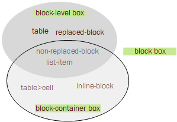

### 9.2 Controlling box generation

接下来的部分将讲述CSS2.2中可能生成的盒子的类型。一个盒子的类型影响着这个盒子在可视化模型（`visual formating module`）中的表现。 `display` 属性决定了盒子的类型。

`display` 属性的值将决定文档中的每个元素都生成一个主体盒子（`principal box`），它包含了后代盒子和生成的内容，而且也将参与后续的定位。但也有例外，比如 `display: list-item` 的元素将生成一些除主体盒子之外的盒子（`additioinal box`），这些盒子的位置与主体盒子密切相关。

> Note:

> 我认为这类所谓的 `additional box` 指的就是list-item 元素前面可以通过list-style来控制的装饰点。

#### 9.2.1 Block-level element and block boxes

***Block-level element*** (块级元素)  文档中的元素被格式化为可视的块，而且块级元素会生成一个块级主体盒子。 `display` 值为 `block`、`list-item`、`table` 可以是一个元素成为一个块级元素。

***Block-level boxes*** (块级盒子) 包含在BFC(`block formatting context`)的盒子被称为块级盒子。

在CSS2.2中，除table 盒子和替换元素 `replaced element` 的主体盒子之外的块级盒子也是 ***block container box*** (块容器盒子)。

`block container box` 要不就是只包含块级盒子，要不就是只包含行内盒子 (`inline-level box`) 的 `inline formatting context`. 主体盒子是快容器盒子的元素被称为 ***block container element*** (块容器元素)。 `display` 属性值为 `block`、`list-item`、`inline-block` 的非替元素（`non-replaced element`）可以生成块容器元素。

由上可见，块容器盒子不一定都是块级盒子，比如：行内快不可替元素和 `display:table`下的cell 元素就是块容器元素，但不是块级元素。

既是块级盒子又是块级容器盒子的盒子，被称为 ***block boxes*** (块盒子)。

> 简单的梳理下各个术语间的关系：
>> 块级元素生成块级盒子

>> 块容器元素生成块容器盒子

>> 块容器盒子不一定都是块级盒子，块级盒子也不都是块容器盒子

>> 既是块级又是块容器的盒子是块盒子

关系图如下：

> 替换元素：

> 类似img 通过src来展示， input 通过 type 来决定展示类型

在不明确声明的情况的，`block-level box`, `block-container box`, `block box` 统称为 `block` 块。