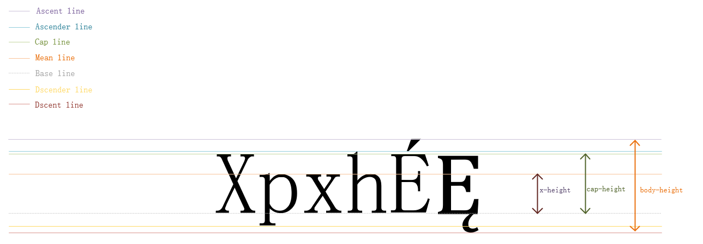
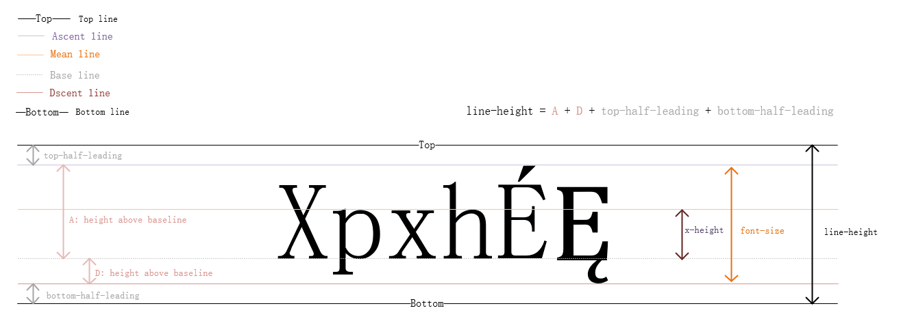

# 你不知道的 `line-height`

在开始介绍 `line-height` 之前，我们先系统的介绍下 font 中的一些基本概念。

### base-line

> In typography, the baseline is the imaginary line upon which a line of text rests. In most typefaces, the descenders on characters such as g or p extend down below the baseline while curved letters such as c or o extend ever-so-slightly below the baseline. The baseline is the point from which other elements of type are measured including x-height and leading. The baseline is also significant in the alignment of drop caps and other page elements.


### mean-line

> Imaginary line running along the top of non-ascending, lowercase letters.

> In typography, the mean line, also (and more simply) known as midline, is the line that determines where non-ascending lowercase letters terminate in a typeface. The distance between the baseline and the mean line is called the x-height.


### Cap-line

> A line marking the height of uppercase letters within a font.


### Ascender

> In typography, the upward vertical stem on some lowercase letters, such as h and b, that extends above the x-height is the ascender. The height of the ascenders is an identifying characteristic of many typefaces.


### Ascender-line

> The invisible line marking the height of ascenders in a font.


### Ascent-line

> The invisible line marking the farthest distance between the baseline and the top of the glyph.


### Descender

> The portion of some lowercase letters, such as g and y, that extends or descends below the baseline is the descender. The length and shape of the descender can affect readability of lines of type and is an identifying factor for some typefaces.


### Descender-line

> The invisible line marking the lowest point of the descenders within a font.


### Descent-line

> The invisible line marking the farthest distance between the baseline and the bottom of the glyph.


### x-height

> In typography, x-height is the distance between the baseline of a line of type and tops of the main body of lower case letters (i.e. excluding ascenders or descenders). The x-height is a factor in typeface identification and readability.


### Cap-height

> The height of a capital letter measured from the baseline.


### Body-height

> The complete area covered by all of the characters in a font. In typography, the body height refers to the distance between the top of the tallest letterform to the bottom of the lowest one.


综合如下图：



# line-height

### 理论知识

在理解了上述的概念后，我们正式开始介绍 line-height.

CSS 假设所有的字体都有自己的度量方法，并且定义了 baseline 以上的高度和以下的深度，这里用 A 代表高度，D 代表深度，AD = A + D 代表从字体顶部到底部的距离。

> CSS 规范推荐使用 `OpenType` 或者 `TrueType` 中 `OS/2` 表格中的 `sTypoAscender` 和 `sTypoDescender` 定义来实现上述的 A 和 D（abs(sTypoAscender) + abs(sTypoDescender) 为元素的 font-size 值），如果系统中的字体缺失如上的定义，那就使用 `HHEA` 表格中的 `Ascent` 和 `Descent` 的定义来实现上述的 A 和 D.

用户代理必须把同一个 non-replaced inline box 中的所有字符按照各自的 baseline 对齐。由于同一个元素中的所有字符可以拥有不同的字体，所以各自的 A 和 D 没有必要都相等。如果一个 inline box 没有任何字符，那么这个元素也会包含一个宽度为 0 的不可见的字符，而且该字符拥有元素可用字体的 A 和 D.

除此之外，每个字符还需要添加行距 L（Leading）. 行距的计算方法如下：

L = line-height - AD.

L/2 添加到 A 的顶部，剩下的 L/2 添加到 D 底部。

> Note: 行距 L 可以为负值。

`line-height` 的值就是包含了所有字符和字符两边的半行距(L/2)的 inline box 的 height.

基于如上描述，做如下图进行更具体的解释：



### 属性介绍
|       |            |
| :---- | :--------- |
| 可用值 | normal <number> <length> percentage inherit |
| 初始值 | normal |
| 适用于 | 所有元素 |
| 是否可继承 | 是 |
| 百分值 | 基于元素自身的 `font-size` 来计算 |


#### `normal`

基于元素的字体，设置一个合理的值，建议设置 line-height 值为 （1.0 ~ 1.2] 直接设置为 `normal`

#### <length>

使用给定的值作为 line box 的高度，负值无效。

#### <number>

使用元素自身 font-size 的 number 倍作为行高，负值无效。

#### <percentage>

基于元素自身的 font-size 来计算，负值无效。

# 应用

在实际开发过程中，我们经常会使用如下方案来实现单行元素的“垂直居中”。

```
{
  height: 60px;
  line-height: 60px;
}
```

接下来，我们就解释下其中的原理。

当 `line-height: 1` 时， 元素的 line-height == font-size, 这时的 L = 0, 也就是说没有行距。

上述方案中，假设元素的 `font-size: 20px`, L = 60 - 20 = 40， L/2 加在 font ascent line 的顶部， L/2 加在 font descent line 的底部，那么单行内容在元素内部就是垂直居中的了。

> Note: 由于有些字体，是让字符坐落在 baseline 上的，所以就算使用了如上方案，在视觉上也不是垂直居中的，这就依赖于用户系统的默认字体或者是用户自定义的字体是什么了，对于中文 浏览器对 微软雅黑 UI 这款字体垂直居中的渲染效果是比较好的。当然我们也可以针对不同的字体手动调整，但是不推荐这么做，因为由于字体差异造成的视觉问题也是 1~2px 级别的，基本可以忽略不计。

# 参考文章

* <http://www.typographydeconstructed.com/>

* <https://www.w3.org/TR/CSS22/visudet.html#line-height>

* <http://stackoverflow.com/questions/27631736/meaning-of-top-ascent-baseline-descent-bottom-and-leading-in-androids-font>

* <https://www.microsoft.com/typography/otspec/recom.htm#tad>

* <https://www.microsoft.com/typography/OTSPEC/hhea.htm>