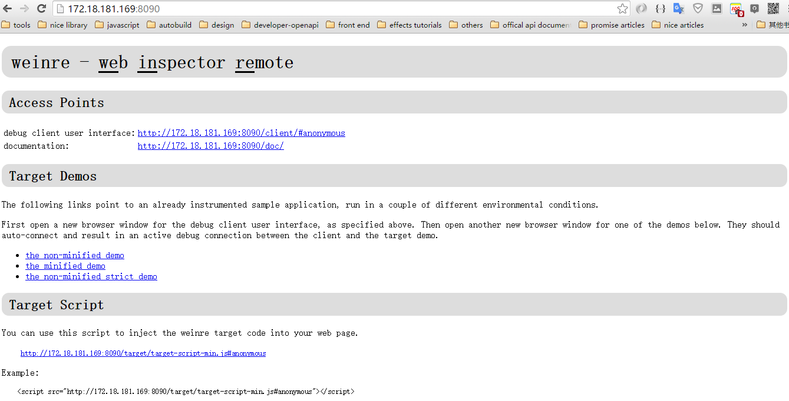
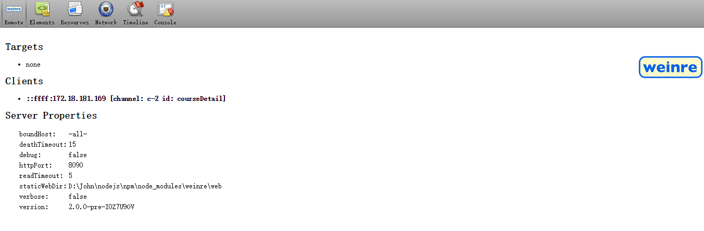

### 什么是远程调试（remote debug）? 为什么需要远程调试？

随着web和移动web的发展，移动web开发越来越受到重视，随之而来的问题就是调试，如果只是做一些宣传活动页，也许在chrome中开启模拟调试就能满足你的需要，但是现实中的开发并不仅仅是这些，越来越多的页面通过webvie被嵌入到native app 中，而且微信平台也越来越稳定，也有很多页面是在微信中展示的，由于android设备的多样性，就导致了，在PC Chorome中通过模拟调试好的页面，在真机中的展示总有或多或少的不一致，所以在这些真机中的调试就显的至关重要，但是由于移动设备的诸多限制，要想在移动设备中像在PC上一样风骚的调试是不可能的，于是，远程调试应用而生。

顾名思义，**远程调试**（*remote debug*）就是在PC中调试真实移动设备中的页面。远程调试的方式多种多样，本文先简但的描述一种，后续的文章中将继续描述其他的方案。

### 通过weinre来实现远程调试

Weinre的本意是Web Inspector Remote。它是一种远程调试工具，可以帮助我们及时更改页面上的元素，样式（就像chrome 的 devtool），调试js(当然这里的调试并不能想chrome中那样断点调试，最起码我们可以看到我们console的信息了，而且可以在wenre的console中调试我们暴露在全局中的变量)。


#### weinre的安装

weinre是通过npm来管理的，所以我们可以通过npm来安装weinre.

```
npm install -g weinre
```

#### weinre的启动

安装完成之后，我们就可以启动weinre的监控服务来进行远程调试了.

```
// 不指定端口，默认端口是8080
weinre --boundHost -all-

// 指定端口
weinre --boundHost -all- --httpPort 8090
```

启动之后，我们就可以通过本机的ip（一般就是我们的局域网内的ip）来访问weinre的服务了，如下图



#### 页面中加入监控脚本

到此还没有完事大吉呢，我们需要在我们的页面中引入一个脚本，并部署我们的页面到测试环境中才可以正式开始远程调试，这个脚本我们可以在weinre启动后的页面的 `Target Script` 部分找到，使用示例如下：

```
// 其中url中的hash是需要我们来自定义的标识，这个标识推荐 使用页面名称，这个名称在监控页面时使用。
<script src="http://172.18.181.169:8090/target/target-script-min.js#自定义的标识"></script>
```

之后我们就可以在浏览其中输入<http://172.18.181.169:8090/client/#自定义标识> 来监控调试远程的页面了。



看到页面有没有发现很熟悉？到此，我们就可以愉快的玩耍了！

##### 真实示例

调试名为courseDetail.html的页面。

页面中加入的脚本如下：

```
<script src="http://172.18.181.169:8090/target/target-script-min.js#courseDetail"></script>
```

浏览器的访问地址如下

```
http://172.18.181.169:8090/client/#courseDetail
```