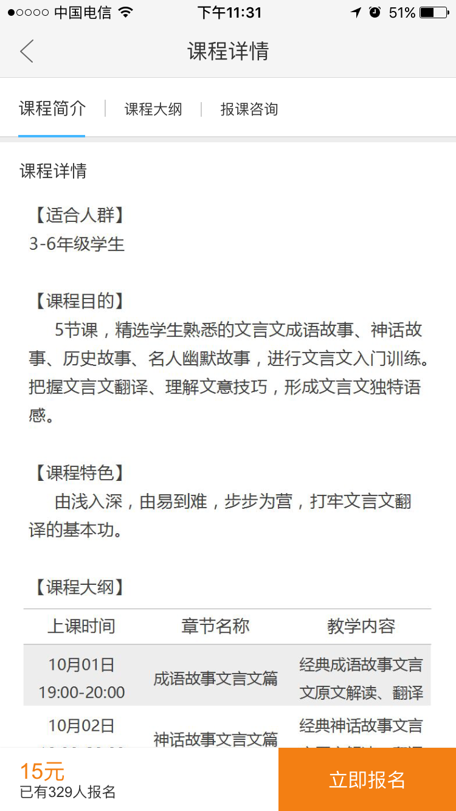
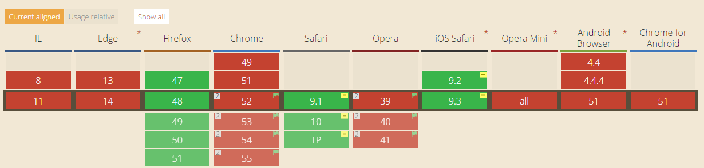

### 移动端吸顶兼容方案 -- position: -webkit-sticky

`吸顶效果`，就是在页面滚动过程中，某个区域（一般来说就是一个 tab 头或者页面中的一个二级导航栏）在即将消失在视口（viewport）时固定在视口的顶部。

实现这个效果离不开对滚动事件（scroll event）的监听，在滚动事件处理器中计算，并在适当的时候修改目标（target）的定位（position）为 `fixed`.

> Note: 我们假定 $ 是全局的 DOM 操作库的句柄。 $target 是目标元素的 $ 对象。

CSS:
```
.absolute{
    position: absolute;
    left: 0;
    right: 0;
    top: 0;
}
```
JS:
```
$(window).on('scroll', function(){
    // 当 $target 要从 viewport 中消失时
    if($target.get(0).getBoundingClientRect().top <= 0){
        $target.addClass('absolute');
    }else{
        $target.removeClass('absolute');
    }
});
```
OK, 搞定！

如果在 PC 端上面的代码基本没有什么问题，移动端 android 手机也没有什么问题，但是到 iOS 中就跪了，效果如下图：



从上面的动图中我们可以看到，target 元素实在页面滑动完全结束后才被固定的，这是什么原因导致的呢，原来在 iOS 系统中 `scroll event` 在页面滑动中只会被触发一次，而且是在页面滚动完全结束后才会触发，有种过渡设计的感觉，如果是为了避免 `scroll event handler` 被高频的执行，完全可以交给应用的开发者来节流。

在这个情况下，要想实现页面滑动时实时触发 `scroll event` 通用的解决方案是通过 `touchmove event` 来触发 `scroll event` 或者执行 `scroll event handler`, 但是这也不是一种完美的解决方案，因为在 `touchend` 后，页面由于惯性还是会滚动一段距离，而有没有一种事件来监听这种惯性滚动，所以要通过这个方案来实现 iOS 中的吸顶效果并不理想。 当然我也不反对去模拟 iOS 的 `scroll event`, 但其复杂度可想而知。

另外一种解决方案就是，接收这个事实，然后在固定的过渡效果上做文章，这样做，不是不可以，但是总有些不甘。

那是不是就没有办法在 iOS 中实现如丝般顺滑的吸顶效果了呢？ 当然不是！

其实在 CSS 的 `position` 属性中有一个属性值 `sticky` . 这个属性是 `relative` 和 `fixed` 的合体版，即：在 target 在 viewport 的可视区是表现和 `relative` 一样，但 target 要从 viewport 中消失的时候，表现又与 `fixed` 一致。如此神奇的属性直接就可以让我们不写一行代码就可以实现如丝般顺滑的吸顶效果。

可是好事多磨，这个属性的支持程度非常不高，目前只有 iOS9 中才有支持，并且需要 `-webkit-` 前缀，如下是 caniuse 的截图：



现在，我们来完成本篇文章移动端吸顶效果终极版：

LESS:

```
.position(@propVal: absolute){
    position: @propVal;
    left: 0;
    right: 0;
    top: 0;
}

.sticky{
    .position(-webkit-sticky);
}

.absolute{
    .position;
}
```
JS:

```
    // 应为 position: -webkit-sticky 支持情况不乐观，所以我们需要进行特性检测
    function isSupportSticky(){
        var propVal = '-webkit-sticky';
        $target[0].style.position = propVal;
        return propVal = $target[0].style.position;
    }

    if(isSupportSticky()){
        $target.addClass('sticky');
    }else{
        // 对于不支持 sticky 的 iOS 低版本, 我们可以在做些固顶的过渡动画来兼容
        $(window).on('scroll', function(){
            if($target.get(0).getBoundingClientRect().top <= 0){
                $target.addClass('absolute');
            }else{
                $target.removeClass('absolute');
            }
        });
    }
```

至此，兼容移动端现代浏览器就完成了，enjoy yoursel!!!

Reference:

[position](https://developer.mozilla.org/en-US/docs/Web/CSS/position)