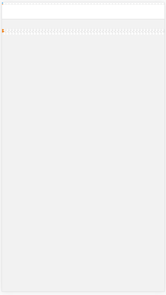

### Hybrid app device width 获取不正确

#### 背景描述：

Hybrid app 中一般都是通过一个新建一个 webview 然后再加载一个 HTML 页面。在 HTML 页面中我们一般都会通过 meta 标签来设置 viewport 的宽高，如下：

```
    <meta name="viewport" content="width=device-width,height=device-height">
```

然后页面中使用 REM 来自适应布局的时候，我们会通过 js document.documentElement.clientWidth 来校正 root 元素的 font-size 值，clientWidth 就是我们设置的 viewport 的 width, 也就是 device-width.

#### 问题描述：

IOS 某个新增的 webview 页面字体、布局偶尔会变的很小，完全看不清，like this:



#### 问题分析：

这个问题有两个点需要解决：

1. 字号不正确

2. 偶发

#### 问题原因：

先看问题1：

经过调试发现问题的原因是在校正 root 元素的 font-size 值时，获取到的 clientWidth == 0，也就是拿到的 device-width == 0，可以定位问题出现在端上，跟端同学对了一下，确实是在初始化 webview 的时候设置 webview 的尺寸为 0， 然后在 view 展现后才正确设置尺寸为设备的宽高。

解决的方法当然就是在 webview 初始化的时候就正确设置 webview 的尺寸为设备的宽高。

问题2：

这种情况在线上的时候是偶发，并不是毕现的，但是在调试阶段，在 js 中 alert 就可以毕现，原因就是 alert 会挂起主线程，导致 webview 的后续操作也被挂起，这样当页面去校正 root font-size 的时候 webview 的 width 是初始化时的 0，当关闭 alert 后，就算 webview 重新设置了正确的尺寸，但是 root 的 font-size 已经设置为了 0.

这也没有解释偶发的真正原因，其实原因就是 ios webview 去 loadUrl 的时候是异步的，他不会阻断 webview 的正常渲染，所以问题会不会出现就依赖于页面加载的速度了，如果网速快，页面在 webview 的尺寸被正确赋值前就加载完了，那么这时获取的 clientWidth 为 0, 问题就出现了，而网速慢的时候，页面在 webview 的尺寸正确赋值后加载完，那么 clientWidth 就获取到了正确的值，问题也就不会出现。

#### 思考

1. 其实这个问题理论上前端也是可以处理的，通常我们会在 rem 的脚本中监听 resize 事件，当 webview 第二次设置的时候，就会触发 resize 事件，重新校正 root font-size， 这样页面也就可以正常渲染。但是这个方案是不可将就的，首先 rem 脚本执行了两次，这个还好，要命的是，页面发生了重排，这种代价是比较昂贵的。

2. 之前还遇到过一个问题，也是 webview 中，页面明明不满一屏，但是还是出现了垂直滚动条，原因是 webview 的初始化高度被设置为了 device-height, 但是这个 webview 还有顶部或底部的 bar, 显然当 webview 展示出来后就会出现垂直滚动条。之前的解决方案是在页面中的 meta 中不设置 viewport 的 height 值或者指定为某个值，其实我们对于某个特殊的 webview 我们可以让端同学在初始化 webview 的高度的时候，减去那些额外的 bar 的高度，这样我们就不用在自己的模板中复写基模板的 viewport meta 标签了。

#### 参考

iOS 中 UIWebView 的生命周期

<http://www.jianshu.com/p/85c98a9e93eb>

#### 一、 大体流程：
(loadView/nib)文件来加载view到内存-->viewDidLoad函数进一步初始化这些view-->内存不足时， 调用viewDidUnload函数释放views-->当需要使用view时又回到第一步

loadView：

永远不要主导调用这个函数。

viewController 会在view的property被请求并且当前view值为nil时调用这个函数。如果你手动创建view， 你应该重载这个函数，切不要在重载的时候调用[super loadView]。

viewDidload:

这个函数的作用主要是让你可以进一步的初始化你的views。

viewDidLoad通常负责的是view及其子view被加载进内存之后的数据初始化的工作，即视图的数据部分的初始化

viewDidUnLoad：

这个函数时viewDidLoad的对立函数。在程序内存欠缺时，这个函数被controller带哦用，来释放他的view以及view相关的对象。由于controller通常保存着view以及相关的object的引用，所以你必须使用这个函数来放弃这些对象的所有权以便内存回收，但不要释放那些难以重建的数据

viewWillAppear:

视图即将可见时调用，默认情况下不执行任何操作。

viewDidAppear：

视图已完全过渡到屏幕上时调用

viewWillDisappear：

视图被驳回时调用，覆盖或以其他方式隐藏，默认情况下不执行任何操作

viewDidDisappear:

视图被驳回后调用，覆盖或以其他方式隐藏。默认情况下不执行任何操作

didReceiveMemoryWarning:

当程序内存过度时，系统会调用该方法

#### 二、Controller和View的生命周期

这里指的View是指Controller的View。它作为Controler的属性，生命周期在Controller的生命周期内。就是说你的Controller不能在view释放前就释放了。

当你alloc并init了一个ViewController时，这个ViewController应该是还没有创建view的。ViewController的view是使用了lazyInit方式创建，就是说你调用的view属性的getter：［self view］。在getter里会先判断view是否创建，如果没有创建，那么会调用loadView来创建view。loadView完成时会继续调用viewDidLoad。loadView和viewDidLoad的一个区别就是：loadView时还没有view。而viewDidLoad时view以及创建好了。
当view被添加其他view中之前时，会调用viewWillAppear，而之后会调用viewDidAppear。

当view从其他view中移出之前时，会调用viewWillDisAppear，而之后会调用viewDidDisappear。

当view不在使用，而且是disappeared，受到内存警告时，那么viewController会将view释放并将其指向nil。